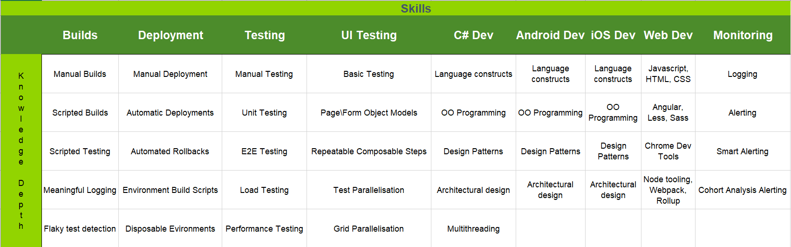
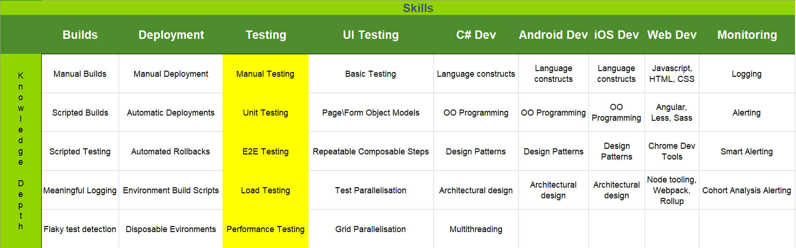
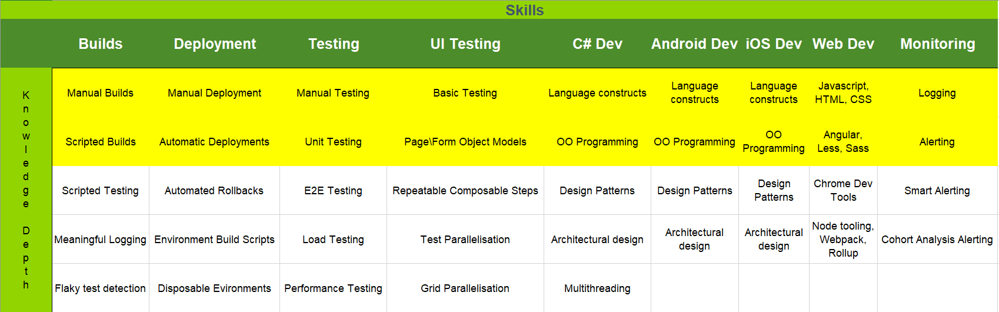
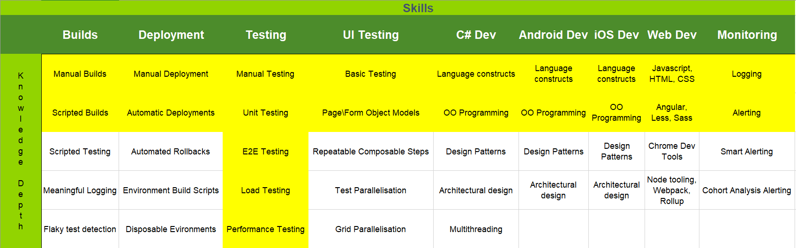

- title : Cross Functional Teams
- description : Comparison of differeneces between languages used by Kantar
- author : Mark Broadhurst
- theme : sky
- transition : default

***

## Cross Functional Teams

***

### What are T-Shaped People?

---

### Skills Matrix

---

### I Shaped People

---

### Generalists

---

### T-Shaped people

***

#### What Langauge is this?

    let a = 5
    let factorial x = [1..x] |> List.reduce (*)
    let c = factorial a
---

#### What Langauge is this?

    [lang=js]
    function copyWithEvaluation(iElem, elem) {
        return function (obj) {
            var newObj = {};
            for (var p in obj) {
                var v = obj[p];
                if (typeof v === "function") {
                    v = v(iElem, elem);
                }
                newObj[p] = v;
            }
            if (!newObj.exactTiming) {
                newObj.delay += exports._libraryDelay;
            }
            return newObj;
        };
    }

---

#### What Langauge is this?

    [lang=swift]
    func switchToCountry(country:CountryName.Country){
        
        if(getCurrentCountry() != country.rawValue){
            self.setCurrentCounntry(country: country.rawValue)
            self.countryStringFileName = getLocalization(country: country)
        }
        
        let appDelegate = UIApplication.shared.delegate as! AppDelegate
        appDelegate.checkAndUpdateAppConfigurationn()

    }

---

#### What Langauge is this?

    [lang=java]
    public void updateProfileInView(Profile profile) {
        Fragment currentFragment = getFragmentManager().findFragmentById(R.id.demographic_container);
        if (currentFragment != null) {
            Log.d(logTag(), "updateProfileInView() - " + currentFragment.getClass().getSimpleName());
            if (currentFragment instanceof UpdateableProfileFragment) {
                ((UpdateableProfileFragment) currentFragment).setUpdatedProfile(profile);
                return;
            }
        }

        Log.d(logTag(), "No UpdateableProfileFragment found");
    }

---

#### What Langauge is this?

    [lang=cs]
    public void onShowPermissionRationale(
        List<String> permissionList, 
        RuntimePermissionRequest permissionRequest) {
        permissionRequest.retry();
    }

---

#### What Langauge is this?

    [lang=swift]
    var daysRemaining: Int {        
        let calendar = Calendar.current
        let components = calendar.dateComponents([.day], from: Date(), to: expiryDate)
        let daysRemaining = components.day ?? 0
        return max(daysRemaining, 0)
    }

***

Questions?

---

Thanks
